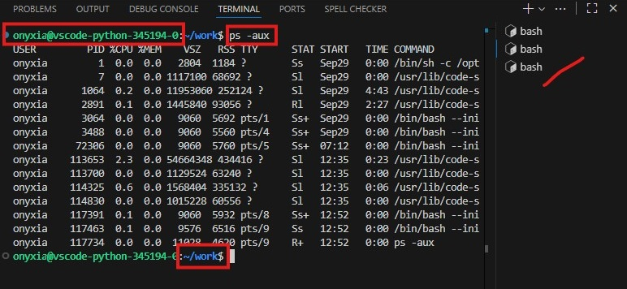

::: {.callout-note}
Les consignes de ce TP sont données pour une utilisation de GitHub. 

Il est possible de réaliser ce TP avec GitLab dont l'interface est très ressemblante.

⚠️ Il y a tout de même quelques différences, par exemple : GitHub Repository = GitLab Projet
:::

## À faire à la maison {.unnumbered}

- [ ] Lire l'introduction
- [ ] Créer un compte sur [GitHub](https://github.com/){target="_blank"}
  - GitHub ⏩ [Sign up](https://github.com/signup){target="_blank"}


::: {.callout-tip title="Ajoutez un mail perso"}
Lors de la création de compte, si vous utilisez votre adresse mail ENSAI, nous vous conseillons d'ajouter un mail personnel :

- GitHub ⏩ Settings ⚙️ ⏩ Email ([lien direct](https://github.com/settings/emails){target="_blank"})

Comme vous ne serez pas étudiant toute votre vie, cela vous évitera de perdre votre accès par la suite.
:::


## Introduction {.unnumbered}

[Git](https://git-scm.com/){target="_blank"} est un **formidable** outil de versionnage de fichiers qui va vous permettre de conserver efficacement l'historique de votre code aussi bien si vous travaillez seul mais également quand vous travaillez à plusieurs.

Cet historique est conservé dans ce que l'on appelle un *dépôt git*.

Sa conception décentralisée fait qu'il est quasi impossible de perdre une donnée définitivement avec git. En particulier, la perte totale d'un ordinateur hébergeant votre code ne représentera qu'une perte minime de code si vous utilisez git correctement.

En outre, de nombreux outils de *CI/CD* (*Continuous Integration / Continuous Deployment*) qui rendent possible l'automatisation de l'intégration et du déploiement de votre code s'appuient sur un *dépôt git*.

### Concepts Clés {.unnumbered}

Comme tout logiciel, git demande un peu d'apprentissage, et de la pratique. 🧠

Pour commencer, nous aurons besoin de certains concepts essentiels pour une utilisation efficace. Par sa conception décentralisée, un dépôt git peut exister en plusieurs endroits en même temps : 

- sur notre machine
- sur chaque machine des membres du projet
- ou sur un serveur hébergeant le projet

Nous parlerons de la *copie distante* (*remote* en anglais) du dépôt dans le cas du serveur distant. En général, une seule copie distante est utilisée, mais par sa nature décentralisée, plusieurs copies distantes sont possibles (possibilité non incluse dans ce TP).

La copie sur notre machine est la *copie locale* (*local* en anglais). Il s'agit de toutes les informations du dépôt concernant l'historique de ses fichiers, et les métadonnées du dépôt. Une distinction subtile est alors faite entre la copie locale et la *copie de travail* (*working copy* en anglais) : nos modifications sur les fichiers du dépôt n'intégrerons la copie locale qu'à notre demande explicite. Cette intégration sera alors effectuée par l'ajout d'une entrée à l'historique du dépôt.

### Programme {.unnumbered}

Dans ce TP, nous allons créer un dépôt distant et deux dépôt locaux. Ensuite nous allons les faire évoluer et les synchroniser. 🔄

```{mermaid}
flowchart
    github[(Remote)]
    dev1[(Local 1)]
    dev2[(Local 2)]
    
    github <--> dev1
    github <--> dev2
```


Pour utiliser git, donc pour gérer un dépôt, nous avons accès à de nombreuses commandes.
Pour ce TP de découverte, les commandes suivantes suffiront :

| Commande                    | Description                              |
|-----------------------------|------------------------------------------|
| `git clone <url>`           | Créer un dépôt local sur son poste       |
| `git status`                | Voir où l'on en est                      |
| `git add <file>`            | Ajouter pour le prochain commit          |
| `git commit -m "<msg>"`     | Créer un point de sauvegarde             |
| `git pull`                  | dépôt local ⬅️ dépôt distant   |
| `git push`                  | dépôt local ➡️ dépôt distant  |


## Environnement de travail

Les commandes seront saisies dans un terminal Git Bash.

Vous allez utiliser un service Vscode-python du datalab. Celui-ci inclut Git Bash.

- [ ] Connectez-vous sur <https://datalab.sspcloud.fr/>{target="_blank"}
  - alternative : <https://onyxia.lab.groupe-genes.fr/>{target="_blank"}

Durant ce TP, vous allez transférer du code entre votre dépôt local (service VSCode du datalab) et votre dépôt distant (hébergé sur GitHub). Pour valider ces transferts un processus d'authentification est naturellement requis. 🔒 🔑

### Génération et déclaration d'un Token

> Pour éviter de vous authentifier (user+password) à chaque commande Git, vous allez utiliser un jeton. :coin:

::: {.callout-important}
Si vous avez déjà créé et déclaré un jeton par exemple lors du TP Datalab, inutile de le refaire. Vous pouvez passer à la section suivante.

Ce paramétrage n'est à faire qu'une seule fois, jusqu'à expiration du jeton.
:::

- [ ] Ouvrez [cette page](../datalab/basics.qmd) qui contient les instructions suivantes
- [ ] Lisez le principe du Token
- [ ] Créez un Token sur GitHub
- [ ] Déclarez-le sur le SSPCloud

## VSCode

Vous allez travailler dans un service VSCode. C'est ici que sera hébergé votre dépôt local.

- [ ] Lancez, puis ouvrez un service **Vscode-python** 🚀

::: {.callout-important title="à la fin du TP"}
N'oubliez pas de supprimer votre service !

Rappel sur le principe des datalabs :

- Des ressources sont à disposition de tous
- Un service lancé = des ressources réservées (cpu, ram, Go...)

Une fois votre travail terminé :

- sauvegardez votre code : envoi au remote avec git
- exportez vos résultats : par exemple en utilisant le stockage S3
- libérez ces ressources : supprimez vos services (ou mettez en pause)
:::

- [ ] Ouvrez un terminal
  - ☰ (en haut à gauche) ⏩ Terminal ⏩ New
  - raccourci : [CTRL]{.keyboard} + [ù]{.keyboard}


## Git Bash et Unix

Avant de nous lancer avec git, prenons quelques minutes pour découvrir le terminal Git Bash et les principales commandes Unix.

En tant qu'ingénieur, cela vous sera utile un jour. Pour vous aider, voici la [liste des commandes principales](presentation.html#commandes-unix){target="_blank"}.


### Un terminal ?

Un terminal est une interface texte qui permet de donner des commandes à l'ordinateur.

C'est une alternative à la souris pour naviguer, créer des fichiers, lancer des programmes.

Git Bash est un terminal qui :

- émule un environnement type Linux/Unix
- inclus les commandes Git

::: {.callout-tip}
Le terminal, c'est sobre, c'est rapide, c'est efficace. 😎

Le terminal reste un outil très utilisé en informatique, même à l'ère du tout *clic-bouton*. Il permet d'aller droit au but sans passer par des menus parfois longs et compliqués.

Rapide et léger, il s'adapte aussi bien aux petites tâches qu'aux opérations plus techniques.

Les développeurs et administrateurs l'utilisent au quotidien pour automatiser et gagner du temps.
:::

### Démystifions la bête



Dans le terminal, vous avez :

- un prompt (username, host, folder)
  - vous êtes connecté avec l'utilisateur *onyxia* sur la machine virtuelle *vscode-python-345194-0*
  - vous êtes positionné dans le dossier `~/work` (~ est le dossier personnel de l'utilisateur)
  - il se termine par un `$`
- à côté, vous pouvez écrire une commande
- en dessous, vous avez le résultat de la commande
- à droite, vous avez vos terminaux (c'est possible d'en ouvrir plusieurs)
  - 💡 ça peut-être utile de les renommer, sinon ils s'appellent tous pareil


### Premières commandes

Commençons par quelques commandes simples :

- [ ] Affichez le répertoire courant
- [ ] Positionnez-vous dans le dossier parent
- [ ] Listez les fichiers et dossiers
- [ ] Retournez dans le dossier *work*
- [ ] Créez deux dossiers nommés *clone1* et *clone2*


### Fichiers

Faisons maintenant quelques manipulations sur des fichiers :

- [ ] Créez un fichier *a.txt* contenant le résultat de la commande `env` 
  - *env* : liste des variables d'environnement
  - `env > a.txt`
- [ ] Créez une copie de ce fichier que vous nommerez *b.txt*
- [ ] Listez les fichiers du dossier courant
- [ ] Renommez *a.txt* en *c.txt*
- [ ] Affichez le contenu du fichier *b.txt*
- [ ] Filtrez le contenu du fichier *b.txt* pour n'afficher que les lignes contenant *GIT*
  - `cat b.txt | grep GIT`
  
Vous devriez retrouver ici votre token. Les variables d'environnement sont un système clé-valeur, pour récupérer votre jeton :

- [ ] `echo $GIT_PERSONAL_ACCESS_TOKEN`

::: {.callout-tip title="Raccourcis très utiles"}
- Les flèches [🠥]{.keyboard} et [🠧]{.keyboard} pour naviguer dans l'historique des dernières commandes et éviter de retaper 10 fois la même commande
- [⇆]{.keyboard} (tabulation) pour l'autocomplétion (située à gauche du clavier dessous [²]{.keyboard} et dessus [:lock:]{.keyboard})
  - Tapez `cat b`, puis appuyez sur la touche [⇆]{.keyboard}
  - Il n'y a qu'un seul fichier commençant par *b* donc l'autocomplétion s'effectue
:::

## Dépôts Git

> Passons maintenant au thème central de ce TP : Git et la synchronisation des dépôts.

Avant de se lancer, exécutez ces deux commandes qui vous éviteront peut-être d'être bloqué par la suite :

- [ ] `git config --global core.editor "code-server --wait"`
- [ ] `git config --global core.mergeoptions --no-edit`

::: {.callout-note title="Explications" collapse="true"}
- `git config --global core.editor "code-server --wait"` 
  - ↪️ configure VS Code comme l'éditeur par défaut pour Git à la place de Nano. 
- `git config --global core.mergeoptions --no-edit`
  - ↪️ configure Git pour qu'il n'ouvre pas l'éditeur de texte lors d'une fusion réussie, utilisant directement le message de commit de fusion par défaut.
:::


### Créez un dépôt distant

> Commençons par créer notre remote sur GitHub.

- [ ] Créez un [nouveau Repository](https://github.com/new){target="_blank"} sur GitHub (GitHub ⏩ Repositories ⏩ [New]{.green-button})
  - Repository name : *tp-git*
  - Visibility Level : *Private*
  - ☑ Cochez *Add a README file*
  - Add .gitignore : *Python*
  - Choose a license : *MIT Licence*
  - Cliquez sur [Create Repository]{.green-button}

Votre remote est maintenant créé.

::: {.callout-important}
Dans le cadre de ce TP, il est interdit d'éditer des fichiers directement sur GitHub. ⛔ \
Ce n'est pas une bonne pratique.

Toutes les modifications doivent être faites sur votre clone local et ensuite envoyées vers GitHub.
:::


### Privé, public ?

Vous avez déclaré votre dépôt **Privé**. C'est adapté dans ce cas, car nous sommes dans le cadre d'un exercice où l'idée n'est pas de faire du code propre mais de pratiquer.

À l'inverse, n'hésitez pas à déclarer public vos travaux aboutis, non confidentiels.

| Critère                   | Dépôt Public          | Dépôt Privé                             |
| ------------------------- | --------------------- | --------------------------------------- |
| **Visibilité**            | Tout le monde peut voir | Uniquement les personnes invitées     |
| **Collaboration externe** | Ouvertes (issues, forks, PR) | Restreinte à l'équipe            |
| **Confidentialité**       | Aucune, tout est visible | Sécurisé, accès contrôlé             |
| **Usage typique**         | Projets Open Source, propres, aboutis | Travaux privés, sandbox |

: {tbl-colwidths="[30,35,35]"}

::: {.callout-note title="Invitations"}
Que le dépôt soit public ou privé, vous devez faire partie des collaborateurs pour y contribuer. "Dépôt public" signifie que tout le monde peut le voir, mais pas le modifier directement.

Pour autoriser des personnes à écrire sur votre dépôt vous devez les inviter :

- Sur la page du repo ⏩ Settings ⏩ Collaborators ⏩ Add people
:::


### Créez un dépôt local

> Vous allez maintenant créer une copie locale du remote en le clonant.

Sur la page GitHub de votre repo :

- [ ] Cliquez sur [<> Code]{.green-button}
- [ ] Copiez la ligne *Clone with HTTPS*

Vous obtenez une url de ce type : `https://github.com/<username>/tp-git.git`

- [ ] Modifiez-là ainsi pour y intégrer votre token avant *github.com*
  - `https://$GIT_PERSONAL_ACCESS_TOKEN@github.com/<username>/tp-git.git`

::: {.callout-tip}
Vous êtes dans VSCode, créez un fichier texte pour faire ces modifications.
:::

Dans le terminal Git Bash de VSCode :

- [ ] Positionnez-vous dans le dossier *clone1*
- [ ] Créez votre clone
  - `git clone <url ci-dessus>`
- [ ] Listez les fichiers et dossiers du répertoire courant
  - Normalement, le dossier *tp-git* est apparu
  - C'est le clone du repo que vous venez de créer
- [ ] Entrez dans ce dossier

Vous êtes maintenant dans un repo git, vous pouvez donc exécuter des commandes git !

- [ ] Vérifiez sur quel dépôt distant votre clone est branché 🔌
  - `git remote -v`
  - Vous devez voir ici votre token et l'url du remote
- [ ] Listez le contenu
- [ ] Comparez à ce que vous avez sur GitHub : `https://github.com/<username>/tp-git`

Vous avez maintenant tout ce qu'il faut pour travailler avec git.

## Premiers pas

Dans ce dépôt local, vous allez commencer par créer de nouveaux dossiers et fichiers sur votre dépôt local. 📁

- [ ] Créez un dossier *src*
- [ ] Dans ce dossier, créez un fichier *voiture.py*
  - `touch src/voiture.py`
- [ ] Ouvrez ce fichier, collez ce code et [**enregistrez**]{.underline} ([CTRL]{.keyboard} + [S]{.keyboard} )

```{.python filename="voiture.py"}
class Voiture:
    """Classe représentant une voiture.

    Attributes
    ----------
    nom : str
        le nom de la voiture.
    couleur : str
        la couleur de la voiture.
    vitesse : int
        la vitesse de la voiture (initialisée à 0).
    """
    def __init__(self, nom: str, couleur: str):
        """Constructeur"""
        self.nom = nom
        self.couleur = couleur
        self.vitesse = 0

    def __str__(self):
        return f"La voiture {self.nom} de couleur {self.couleur} roule à {self.vitesse} km/h."

```

Vous venez de créer quelques nouveaux éléments sur votre clone, envoyons-les maintenant au remote.

```{.txt filename="Votre dépôt"}
tp-git/
├── .gitignore
├── LICENSE
├── README.md
└── src/
    └── voiture.py
```

### Add, Commit et Push

::: {.callout-important}
C'est l'enchainement de commandes qu'il faut connaitre ! (avec une pincée de *status* si besoin)
:::

Avant de commencer, vérifiez dans votre terminal que vous êtes bien positionné à la racine de votre dépôt i.e. votre dossier courant est *tp-git*.

Dans le terminal *Git Bash*, exécutez les commandes suivantes : 

- [ ] `git status`
  - différences entre la version de travail du code et le commit le plus récent
  - le dossier *src* apparait dans *Untracked files*
  - cela signifie que Git a repéré ce dossier mais qu'il ne le versionnera pas pour le moment
- [ ] `git add src`
  - pour faire reconnaitre ce dossier et le placer la zone de transit
  - ce dossier et ses fichiers seront versionnés dans le prochain commit
- [ ] `git status`
  - *Changes to be committed* : *new file:   src/voiture.py*
  - le fichier est maintenant reconnu par Git

Nous allons maintenant créer un point de sauvegarde :

- [ ] `git commit -m "Création classe voiture"`
  - entre les guillemets, mettez un message court et explicite. Ce message est obligatoire !
- [ ] `git status`
  - *Your branch is ahead of 'origin/main' by 1 commit*
  - i.e. votre dépôt local est en avance d'un commit par rapport au remote

Enfin, nous souhaitons envoyer notre commit vers le remote.

- [ ] `git push`
  - pousse vos commits vers le dépôt distant. 
  - ⚠️ si vous avez modifié des fichiers qui ne sont pas dans un commit, ces modifications n'apparaitront pas sur le dépôt distant

Allez sur la page GitHub de votre repo et vérifiez que vos fichiers sont bien arrivés.

::: {.callout-warning title="Ça ne marche pas"}
Vous avez tout bien fait mais votre fichier *voiture.py* n'est pas à jour sur GitHub. 😕

- est-ce que votre fichier *voiture.py* a bien été enregistré ? 
  - sinon recommencez (Add, Commit, Pull et Push). 😩
- Est-ce que vous êtes bien connecté au remote avec votre token ?
  - `git remote -v` pour vérifier
  - `git remote set-url origin https://$GIT_PERSONAL_ACCESS_TOKEN@github.com/<username>/tp-git.git` si besoin pour corriger l'url du remote
:::

### Les états Git

Pour résumer voilà ce que vous avez fait :

::: {.white-box}
```{mermaid}
sequenceDiagram
    Workspace ->> Staging index: add
    Staging index ->> Local repository: commit
    Local repository ->> Remote repository: push
    Remote repository ->> Workspace: pull
```
:::

> Comprendre les états Git :

- **Workspace (Répertoire de travail)** : C'est votre espace de création. C'est le dossier sur votre ordinateur où vous créez, modifiez ou supprimez concrètement vos fichiers. À ce stade, vos modifications sont "volatiles" et ne sont pas encore suivies par Git.
- **Staging Index (Zone de transit)** : C'est une zone de préparation (un "panier"). Elle vous permet de sélectionner précisément les modifications que vous souhaitez inclure dans votre prochain commit. Cela évite d'envoyer des fichiers accidentels ou incomplets.
- **Local Repository (Dépôt Local)** : C'est la base de données Git située sur votre machine. Une fois un changement "commité", il est sauvegardé de manière permanente dans l'historique de votre projet. Vous pouvez ainsi voyager dans le temps et revenir à n'importe quelle version précédente.
- **Remote Repository (Dépôt Distant)** : C'est la version de votre projet hébergée sur un serveur (comme GitHub). Il sert de point de synchronisation pour partager votre travail avec d'autres collaborateurs ou pour disposer d'une sauvegarde en ligne.


> Pour rendre ces concepts plus intuitifs, imaginons que vous êtes un photographe de studio.

| Transition | Commande | Analogie du Photographe 📷 |
| ---------- | -------- | --------------------------- |
| **Workspace → Staging** | `git add` | **La Mise en Scène** : Vous disposez les modèles et les accessoires sur le plateau. Vous ajustez la lumière et la position. Tout est prêt pour la photo, mais rien n'est encore figé. |
| **Staging → Local Repo** | `git commit` | **Le Clic** : Vous déclenchez l'obturateur. **CLIC !** L'image est capturée et enregistrée sur votre carte mémoire. La scène est désormais figée dans le temps. |
| **Local Repo → Remote Repo** | `git push` | **La Publication** : Vous téléchargez vos clichés sur un album partagé en ligne pour que vos amis puissent les voir. |
| **Remote Repo → Workspace** | `git pull` | **La Mise à jour** : Un ami a ajouté des photos à l'album partagé ; vous les téléchargez et les intégrez directement dans votre studio pour travailler dessus. |

: {tbl-colwidths="[28,15,57]"}


::: {.callout-tip title="Aller plus haut (Maîtriser la synchronisation)"}
En réalité, le `git pull` récupère les modifications du dépôt distant avec `git fetch`, puis les intègre avec `git merge`.

| Transition | Commande | Analogie du Photographe 📷 |
| ---------- | -------- | --------------------------- |
| **Remote Repo $\rightarrow$ Local Repo** | `git fetch` | **La Consultation** : Vous ouvrez l'album partagé pour voir s'il y a du nouveau. Vous voyez qu'il y a de nouvelles photos, mais vous ne les avez pas encore téléchargées sur votre propre appareil. |
| **Local Repo $\rightarrow$ Local Repo** | `git merge` | **L'Intégration** : Vous prenez les nouvelles photos que vous venez de consulter et vous les fusionnez avec votre propre collection pour qu'elles fassent partie de votre historique. |

: {tbl-colwidths="[28,15,57]"}

:::


### One more time

Retournez sur VSCode :

- [ ] Ajoutez à la fin du fichier `voiture.py` ce code et [**enregistrez**]{.underline}
  
```{.python filename="voiture.py"}
    # ...

    def accelere(self, increment:int) -> None:
        """Augmente la vitesse de la voiture.

        L'incrément maximal est de 10 km/h.
        La vitesse maximale est de 130 km/h.

        Parameters
        ----------
        increment : int
            la valeur de l'accélération demandée (limité à 10)
        """
        if increment > 10:
            increment = 10
        self.vitesse = min(130, self.vitesse + increment)
```

Dans le terminal *Git Bash* :

- [ ] `git status`
  - le fichier *voiture.py* a été modifié
- [ ] `git diff` pour voir les différences depuis le dernier commit
  - *q* pour quitter
- [ ] `git add .` pour ajouter toutes les modifications de tous les fichiers au prochain commit
- [ ] Comme précédemment, faites un *commit*

### Historique du dépôt

Pour accéder à l'historique d'un repo :

- [ ] Sur GitHub, vous pouvez consulter l'historique du dépôt distant
  - en cliquant sur *Commit* (en dessous du bouton [<> Code]{.green-button})
  - historique d'un fichier en ouvrant ce fichier et en cliquant sur *History*
- [ ] Sur votre dépôt local avec l'extension Git Graph de VS Code
  - à gauche, sous l'icone 🔍
- [ ] Via le terminal : `git log`
  - ce n'est pas aisément lisible
  - heureusement il est possible d'améliorer cette commande

:::::: {.callout-tip title="Pour avoir un résultat plus agréable"}

:::{.panel-tabset .nav-pills}

#### Pretty log

`git log --pretty=format:'%C(yellow)%h %C(green)%ad %C(blue)%an%C(green)%d %Creset%s' --date=relative`

- chaque ligne représente un commit
- la première colonne correspond au numéro court de commit
- vous remarquez un décalage entre *HEAD* et *origin/HEAD* (entre dépôt local et distant)
  - **HEAD** : pointeur qui représente la version actuelle du code dans votre espace de travail
  - **main** (ou master) : nom de la branche principale par défaut
  - **origin** : désigne le dépôt distant
- *q* pour quitter

#### Alors ?



#### Alias

Ce n'est pas évident de se souvenir de commandes aussi longues.

Une solution est de créer un alias :

- [ ] Créer par exemple l'alias blog (beautiful log)
  - `git config --global alias.blog "log --pretty=format:'%C(yellow)%h %C(green)%ad %C(blue)%an%C(green)%d %Creset%s' --date=relative"`
- [ ] Maintenant `git blog` suffit pour lancer la même commande

:::
::::::

- [ ] Faites un *push* pour envoyer votre commit vers le dépôt distant
- [ ] Regardez de nouveau votre historique
  - les 2 dépôts sont de nouveau synchronisés


### Exercice d'application

C'est le moment d'appliquer ce que nous venons de voir, à vous :

- [ ] Créez sur votre dépôt local un fichier `src/test_voiture.py` contenant ce code :

```{.python filename="test_voiture.py"}
from voiture import Voiture

def test_accelere_incremente_vitesse():
    # GIVEN
    v = Voiture("4L", "verte")

    # WHEN
    v.accelere(5)

    # THEN
    assert v.vitesse == 5

def test_accelere_limite_increment():
    # GIVEN
    v = Voiture("4L", "verte")

    # WHEN
    v.accelere(20)

    # THEN
    assert v.vitesse == 10

```

- [ ] Envoyez-le sur le remote (GitHub)
- [ ] Créez un fichier `requirements.txt` avec le contenu suivant
  - c'est le nom classique du fichier qui liste les packages python nécessaires au projet
  - `pip install -r requirements.txt` : pour installer les packages du fichier
  - même si dans les projets plus récents vous utiliserez un fichier nommé `pyproject.toml`

```{.txt filename="requirements.txt"}
bandit
duckdb
polars
pytest
ruff
```

- [ ] Envoyez-le sur le remote
- [ ] Affichez votre historique


### Le fichier .gitignore

::: {.callout-note}
Certains fichiers ont vocation à rester seulement sur votre dépôt local, par exemple :

- fichiers de données
- fichiers contenant des mots de passe
- fichiers de logs
:::

Grâce au *.gitignore*, vous pouvez dire à Git d'ignorer certains fichiers.

- [ ] Créer un dossier `data` à la racine de votre dépôt
- [ ] Dans ce dossier, créer un fichier `joueuses.csv` avec ce contenu

```{.txt filename="joueuses.csv"}
id_joueuse,nom,prenom,date_naissance,pays
1,Sebag,Marie,1986-10-15,France
2,Polgar,Judit,1976-07-23,Hongrie
3,Hou,Yifan,1994-02-27,Chine
4,Kosteniuk,Alexandra,1984-04-23,Suisse
5,Ju,Wenjun,1991-01-31,Chine
```

- [ ] Regardez l'état du dépôt
  - le dossier *data* apparait dans les *Untracked files*
- [ ] Ouvrez le fichier *.gitignore*
- [ ] À la fin ajoutez une ligne avec `data/`
- [ ] Regardez l'état du dépôt
  - le dossier *data* n'apparait plus, car maintenant Git ignore ce dossier et son contenu
  - il est bien présent dans votre dépôt local mais il n'arrivera donc jamais sur le dépôt distant

> Autre exemple : lors du projet info de 2e année, votre application python se connectera à une base de données. Or les infos de connexions à cette bdd ne devront pas atterrir sur GitHub !

::: {.callout-caution}
Ajouter un fichier déjà suivi par Git dans `.gitignore` ne suffit pas à arrêter son suivi : Git continuera à le suivre et à détecter ses modifications.
:::


## Simulation de travail en groupe

Pour les questions suivantes, vous allez avoir besoin de 2 dépôts locaux branchés sur un même dépôt distant. \
Il y a 2 possibilités : 

- soit vous travaillez en bînome 👩🏾‍🤝‍👨🏼 (vous avez chacun votre dépôt local)
- soit vous faites seul 🐙 (mais vous gérez 2 dépôts locaux différents)

```{mermaid}
flowchart
    github[(Dépôt distant)]
    dev1[(Dépôt local 1)]
    dev2[(Dépôt local 2)]
    
    github <--> dev1
    github <--> dev2
```

### Mise en place des clones

:::{.callout-note title="Si vous travaillez à 2"}
Un des deux membres va créer un dépôt local à partir du dépôt distant de l'autre.

- [ ] 🐸 fournit à 🐱 l'adresse https de son repo
- [ ] 🐸 donne accès à 🐱 à son repo
  - page GitHub du repo ⏩ Settings ⏩ Collaborators
  - [Add people]{.green-button}
- [ ] 🐱 clone le dépôt distant
  - `cd /home/onyxia/work/clone2`
  - `git clone https://$GIT_PERSONAL_ACCESS_TOKEN@github.com/<username_frog>/tp-git.git`
  - `cd tp-git` pour entrer dans le dépôt Git
:::


:::{.callout-note title="Si vous faîtes seul" collapse="true"}
- [ ] Ouvrez un nouveau terminal
- [ ] `cd /home/onyxia/work/clone2`
- [ ] Clonez à nouveau votre dépôt distant
  - n'oubliez pas d'inclure votre token
- [ ] puis `cd tp-git` pour entrer dans le dépôt Git

Vous allez ainsi avoir deux clones dans votre service VSCode. Une autre alternative pour l'exercice serait de lancer un autre service VSCode-python et d'y créer un clone.

💡 Pour ne pas vous-y perdre, n'hésitez pas à renommer vos dossiers et vos terminaux.
:::

### Synchronisation des dépôts

> Ici, un membre va coder et l'autre va devoir récupérer son code.

- [ ] 🐸 crée un fichier *src/moto.py* avec le code suivant dans son dépôt local :
  
```{.python filename="moto.py"}
class Moto:
    def __init__(self, nom: str, couleur: str):
        self.couleur = couleur
        self.nom = nom
        self.vitesse = 0

    def accelere(self, increment: int):
        if increment > 15:
            increment = 15
        self.vitesse = min(150, self.vitesse + increment)

```

- [ ] 🐸 envoie ce fichier vers le dépôt distant : *add*, *commit* et *push*
- [ ] 🐱 fait ensuite `git pull`
  - il récupère le fichier *moto.py* dans son dépôt local
- [ ] Inversez les rôles (optionnel)
  - 🐱 crée un fichier *velo.py* et le pousse
  - 🐸 le récupère


Nous allons maintenant illustrer le fait que votre dépôt local doit être impérativement à jour pour pousser du code.

### Coder en équipe

Maintenant les deux membres vont coder en même temps mais sur des fichiers différents.

> Attention : 1, 2, 3, partez 🏁

- [ ] 🐱 crée le fichier *src/trottinette.py* en s'inspirant de *moto.py*
- [ ] 🐸 crée un dossier *doc* et à l'intérieur le fichier *state-diag.qmd* avec ce code
  
````{.markdown filename="state-diag.qmd"}
```{mermaid}
stateDiagram
    login : Se connecter
    menu_joueur : Menu Joueur
    logon : Créer un compte      
    [*] --> Accueil      
    Accueil --> login
    login --> menu_joueur      
    Accueil --> logon      
    Accueil --> quitter
    quitter --> [*]
```
````

- [ ] 🐸 envoie son code vers le dépôt distant, ensuite 🐱 fait de même
  - `git add .`
  - `git commit -m "<complétez>"`
  - `git push`

::: {.callout-important}
- Pour 🐸 qui a poussé son code en premier ➡️ tout s'est bien passé
- Pour 🐱, il a du recevoir ce genre de message lors du push
  
```{.dark-code-block}
! [rejected]        main -> dev (fetch first)
error: failed to push some refs to 'git@github.com:ludo2ne/tp-git.git'
hint: Updates were rejected because the remote contains work that you do
hint: not have locally. This is usually caused by another repository pushing
hint: to the same ref. You may want to first integrate the remote changes
hint: (e.g., 'git pull ...') before pushing again.
hint: See the 'Note about fast-forwards' in 'git push --help' for details.
```
:::

Si vous prenez le temps de lire le message, c'est assez clair :

- votre dépôt local est en retard de version par rapport au dépôt distant
- vous devez donc mettre à jour votre dépôt local avant de pousser
- il faut commencer par pull

::: {.callout-tip title="rebase"}
Nous allons ajouter l'option *rebase* pour placer les commits locaux "par-dessus" ceux du remote pour obtenir un historique linéaire, clair et facile à suivre, tout en évitant les commits de fusion superflus.
:::

- [ ] 🐱 commence par `git pull --rebase`
- [ ] 🐱 fait enfin `git push`

Maintenant c'est 🐸 qui a son dépôt local en retard.

- [ ] 🐸 peut faire un simple *pull* car il n'a pas de commits locaux

Exercice d'application :

- [ ] 🐱 modifie et pousse le fichier `voiture.py`
- [ ] 🐸 modifie et pousse le fichier `moto.py`
- [ ] Synchronisez vos dépôts pour avoir tous la dernière version


### Un premier conflit

> Pour le moment vous avez travaillé sur des fichiers différents, donc git arrive à gérer la situation. \
> Maintenant, que se passe-t-il si vous modifiez tous les deux le même fichier ?

Vous allez tous les 2 travailler sur le fichier `voiture.py`. Dans la méthode *accelere()* :

- [ ] 🐱 remplace 130 par 150
- [ ] 🐱 commit et pousse son code (*add*, *commit*, *push*)
- [ ] De son côté, 🐸 remplace 130 par 110
- [ ] 🐸 commit et pousse son code (*add*, *commit*, *push*)

Si vous avez bien compris, vous savez que le push ne va pas fonctionner.

- [ ] 🐸 doit commencer par mettre à jour son dépôt local : `git pull`
  - Et là c'est le conflit...

```{.dark-code-block}
remote: Enumerating objects: 7, done.
remote: Counting objects: 100% (7/7), done.
remote: Compressing objects: 100% (3/3), done.
remote: Total 4 (delta 2), reused 0 (delta 0), pack-reused 0
Unpacking objects: 100% (4/4), 1015 bytes | 8.00 KiB/s, done.
From github.com:ludo2ne/tp-git
   c27c708..05380ea  main       -> origin/main
Auto-merging src/voiture.py
CONFLICT (content): Merge conflict in src/voiture.py
Automatic merge failed; fix conflicts and then commit the result.
```

Git vous prévient qu'il n'est pas arrivé à fusionner les commits automatiquement.

Un conflit est généré quand les mêmes lignes d'un fichier sont modifiés par 2 commits de manière différente. Il doit être géré sur un dépôt local.
  
Votre code ressemble à cela désormais à ceci :

```{.python}
    def accelere(self, increment: int) -> None:
        if increment > 10:
            increment = 10
<<<<<<< HEAD
        self.vitesse = min(110, self.vitesse + increment)
=======
        self.vitesse = min(150, self.vitesse + increment)
>>>>>>> 05380ea70dbd5d4e49371af8da7c0ac1df13a010
```

- La première partie (entre `<<<<<<< HEAD` et `=======`) correspond au code que vous aviez dans votre copie de travail
- La seconde partie est le code provenant du dépôt distant

Plusieurs choix s'offrent à vous :
  
- Imposer votre version 💪 (110)
- Accepter la version de 🐱 (150)
- Choisir une toute autre version (par exemple 120)

Résolvons ce conflit :

- [ ] 🐸 conserve uniquement la ligne avec 110
  - et supprime toutes les autres lignes de  `<<<<<<<` à `>>>>>>>`
  - autre possibilité offerte par VSCode, cliquer sur *Accept Current Change*
- [ ] 🐸 sauvegarde le fichier 
- [ ] 🐸 commit et pousse son code (*add*, *commit -m "resolve merge"*, *push*)
- [ ] 🐱 fait un *pull* pour mettre à jour son dépôt local

::: {.callout-important}
Avoir un conflit, ce n'est pas grave !  
Avoir un conflit, ce n'est pas grave !  
Avoir un conflit, ce n'est pas grave !  
Avoir un conflit, ce n'est pas grave !  
Avoir un conflit, ce n'est pas grave !  

**Conflit ≠ Erreur**

Cela arrive simplement quand Git rencontre deux versions et il n'a pas de :crystal_ball:, ni de :game_die: pour choisir laquelle est la bonne.
:::

Maintenant si nous pouvons éviter, c'est pas plus mal !

::: {.callout-tip title="Éviter les conflits"}
- Essayez de ne pas coder en même temps sur les mêmes fichiers
- Faites des *pull* et *push* réguliers

Plus le code de votre dépôt local sera "proche" de celui du dépôt distant, moins vous en aurez.

En effet, si vous codez pendant 5 jours sans jamais pousser votre code, vous prenez le risque que d'autres personnes modifient les mêmes fichiers et poussent avant leur code.
:::

### Exercice d'application

Dans le constructeur de la classe *Voiture* :

- [ ] 🐱 ajoute un attribut *vitesse_max* qui vaut par défaut 130

```{.python filename="voiture.py"}
    def __init__(self, nom: str, couleur: str, vitesse_max: int=130):
      """Constructeur"""
      self.nom = nom
      self.couleur = couleur
      self.vitesse = 0
      self.vitesse_max = vitesse_max
```

- [ ] 🐸 ajoute un attribut *carburant*
  
```{.python filename="voiture.py"}
    def __init__(self, nom: str, couleur: str, carburant: str):
      """Constructeur"""
      self.nom = nom
      self.couleur = couleur
      self.vitesse = 0
      self.carburant = carburant
```

- [ ] Synchronisez vos dépôts et résolvez les conflits

Vous avez maintenant tous les outils pour un usage simple de git.

::: {.callout-important title="À retenir"}
- Git permet de versionner les fichiers d'un projet et de conserver leur historique.
- Le dépôt local contient une copie complète de l'historique du projet.
- Un dépôt distant permet de partager et de synchroniser le projet avec d'autres personnes.
- `git status` permet de connaître l'état du dépôt.
- `git add` prépare les modifications pour le prochain commit.
- `git commit` enregistre les modifications dans l'historique local.
- `git push` envoie les commits vers le dépôt distant.
- `git pull` récupère les modifications du dépôt distant et les intègre au dépôt local.
- Les conflits apparaissent lorsque Git ne peut pas intégrer automatiquement des modifications concurrentes.
- `.gitignore` permet d'indiquer à Git quels fichiers ne doivent pas être suivis.
:::

## CI

> Bonus

L'intégration continue permet d'automatiser certaines tâches lorsque l'on pousse du code vers un remote, par exemple :

- compiler le projet ou générer un paquet
- lancer les tests unitaires avec *pytest*
- vérifier la qualité du code

Il existe également le Déploiement Continu (CD) qui va installer automatiquement le programme sur un serveur.

Il est possible de créer des pipelines automatisés pour mettre en place du CI/CD.


### Notre premier pipeline

Nous allons créer un pipeline qui va exécuter sur une machine virtuelle vierge :

- installer *ubuntu*
- installer un environnement *python*
- installer les packages python nécessaires (*requirements.txt*)

et ensuite :

- lancer les tests unitaires
- lancer *pylint*, un outil pour évaluer la qualité du code
- vérifier les failles de sécurité avec *bandit*

La fonctionnalité GitHub qui permet de faire cela se nomme *GitHub actions*. GitLab a un équivalent.

```{.yml filename=".github/workflows/ci.yml"}
name: pipeline

on: [push]

jobs:
  build:
    runs-on: ubuntu-latest
    strategy:
      matrix:
        python-version: ["3.13"]
    steps:
    - uses: actions/checkout@v4

    - name: Set up Python ${{ matrix.python-version }}
      uses: actions/setup-python@v5
      with:
        python-version: ${{ matrix.python-version }}

    - name: Install dependencies
      run: |
        python -m pip install --upgrade pip
        pip install -r requirements.txt

    - name: Unit Tests with pytest
      run: pytest

    - name: Analysing the code with pylint
      run: pylint --output-format=colorized --disable=C0114,C0411,C0415,W0718 $(git ls-files '*.py') --fail-under=7.5
        
    - name: Security scan
      run: bandit -r .
```

- [ ] Créez un dossier *.github* puis dans celui-ci un dossier *workflows*
  - c'est important de respecter ces noms précis
- [ ] Dans *worlflows*, créez un fichier *ci.yml* et collez le code ci-dessus
- [ ] Avec git : add, commit et push

Lors d'un push, cela va maintenant déclencher un pipeline sur GitHub.

- [ ] Sur la page du repo GitHub, allez dans l'onglet *Actions*


## Git sur la VM ENSAI {.unnumbered}

> Optionnel

Si vous souhaitez gérer des dépôts locaux sur votre VM ENSAI, vous pouvez utiliser le paramétrage ci-dessous.

La communication avec GitHub se fera avec le protocole *ssh*

### Configuration {.unnumbered}

```{.bash filename="setup-git.sh"}
git config --global user.name "<Prenom Nom>"
git config --global user.email <prenom.nom>@eleve.ensai.fr
git config --global credential.helper store
git config --global core.mergeoptions --no-edit
git config --global core.editor "code -w"
```

### Création d'une clé SSH {.unnumbered}

Pour permettre de faire dialoguer notre dépôt local avec le dépôt distant de GitHub, vous utiliserez le protocole `SSH`. Pour cela, vous allez :

- générer une paire de clés (publique/privée) sur notre machine
- déclarer votre clé publique à GitHub

::: {.callout-warning}
Ce paramétrage SSH est réalisé au niveau de la machine.

Si par exemple, vous souhaitez utiliser Git sur votre ordinateur personnel, il faudra faire également ce paramétrage.
:::

Dans Git Bash :

- [ ] Créez un dossier */c/Users/id????.ssh* pour stocker votre clé ssh
  - `mkdir -p ~/.ssh`
- [ ] Créez une clé SSH
  - `ssh-keygen -t rsa -b 4096 -N '' -q -f ~/.ssh/id_rsa`
- [ ] Copiez le contenu de la clé publique
  - `cat ~/.ssh/id_rsa.pub | clip`
  - c'est comme si vous copiez le contenu du fichier *id_rsa.pub*

Déclarez votre clé publique à *GitHub*, pour pouvoir ensuite faire communiquer dépôts locaux avec les dépôts distants :

- [ ] GitHub ⏩ cliquez sur votre avatar ⏩ Settings ⏩ SSH and GPG keys
  - [lien direct](https://github.com/settings/keys){target="_blank"}
- [ ] Cliquez sur [New SSH key]{.green-button}
  - Title : VM ENSAI
  - Key : Collez votre clé publique
  - [Add SSH key]{.green-button}


::: {.callout-note title="SSH : Comment ça marche ?" collapse="true"}

SSH (Secure Shell) est un protocole permettant de se connecter à un autre ordinateur sur un réseau de manière sécurisée.

SSH chiffre toutes les informations échangées afin de protéger les données.

SSH utilise un mécanisme de clés cryptographiques pour authentifier les ordinateurs et les utilisateurs, garantissant que la connexion est effectuée avec le bon serveur et sans intervention malveillante :

- `Clé privée` : C'est comme la clé de votre maison. Vous la gardez en sécurité avec vous et ne la partagez avec personne. Cette clé reste sur votre ordinateur et sert à prouver votre identité.
- `Clé publique` : Elle serait comme votre adresse postale. Vous pouvez la partager avec d'autres. Dans SSH, vous placez votre clé publique sur les serveurs ou les ordinateurs auxquels vous souhaitez vous connecter.

Ces deux clés sont liées. Un message chiffré par la clé publique n'est déchiffrable que par celui qui possède la clé privée.
Lorsque vous chiffrez un message avec votre clé privée, vous prouvez à tous votre identité car chacun peut déchiffrer ce message avec la clé publique.



:::