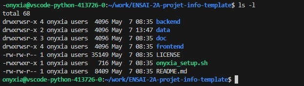

## Introduction

Il y a peu, dans un monde proche — très proche — la ligne de commande était le principal moyen de communiquer avec un ordinateur. Pas de souris, pas de bureau avec des icônes : simplement un clavier et un terminal.

Aujourd'hui encore, dans de nombreux domaines de l'informatique, les instructions se donnent en ligne de commande. En effet, les interfaces graphiques sont souvent plus coûteuses à développer, plus lourdes et plus difficiles à maintenir.

Nous allons ici présenter quelques commandes simples, connues et utilisées par la majorité des informaticiens. Il existe plusieurs shells, sous Unix comme sous Windows. Nous nous intéresserons principalement au shell Bash sous Unix : [Bash](https://fr.wikipedia.org/wiki/Bourne-Again_shell).

En tant que Data Scientist, on ne vous demandera pas de pirater la CIA avec une calculatrice Casio. En revanche, connaître les bases du terminal est un véritable must-have qui vous servira très souvent.

### Glossaire

| Terme                | Définition                                               |
| -------------------- | -------------------------------------------------------- |
| Terminal             | Interface texte permettant d'interagir avec l'ordinateur |
| Ligne de commande    | Texte saisi par l'utilisateur pour demander une action   |
| Shell                | Programme qui interprète les commandes                   |
| Bash                 | Shell Unix très répandu                                  |
| Script               | Fichier contenant plusieurs commandes automatisées       |


### Un terminal



Voici un premier exemple de terminal. Vous avez :

- le prompt : [**onyxia@vscode-python-413726-0**]{style="color: #4ec9b0"}:[**~/work/ENSAI-2A-projet-info-template**]{style="color: #569cd6"}$
  - vous êtes connecté avec l'utilisateur *onyxia* 
  - sur la machine virutelle *vscode-python-413726-0*
  - vous êtes positionné dans le dossier [~/work/ENSAI-2A-projet-info-template]{style="color: #569cd6"}$
  - *~* est le dossier personnel de l'utilisateur
  - il se termine par un `$` (utilisateur normal, `#` pour root)
- à droite du prompt, vous pouvez écrire une commande
  - ici `ls -l`
  - *ls* pour lister les éléments du dossier courant
  - option *-l* pour avoir un affichage détaillé
- en dessous, vous avez le résultat de la commande
  - la liste des dossiers et fichiers


### Fonctionnement

Le terminal est une manière simple de donner des instructions à la machine.

```{mermaid}
flowchart TD

    U[Utilisateur]

    %% CLI
    U -->|commande clavier| TERM[Terminal]
    TERM --> SHELL[Shell]
    SHELL -->|appels système| OS[OS]

    %% GUI
    U -->|clic souris | GUI[Interface graphique]
    GUI -->|événements GUI| APP[Application]
    APP -->|appels système| OS

    %% Hardware
    OS --> Matériel
```

## Principales commandes

::: {.callout-caution}
- `<...>` : texte à remplacer
- `[...]` : élément optionnel
:::


| Commande                      | Signification             | Description                                        |
|-------------------------------|---------------------------|----------------------------------------------------|
| `pwd`                         | print working directory   | Affiche le répertoire courant                      |
| `cd <directory>`              | change directory          | Change le répertoire de travail courant            |
| `ls` (ou `ll`)                | list                      | Liste les fichiers et dossiers                     |
| `mv <src> <dest>`             | move                      | Déplace un fichier ou un répertoire                |
| `cp <src> <dest>`             | copy                      | Copie un fichier ou un répertoire                  |
| `mkdir <directory>`           | make directory            | Crée un nouveau répertoire                         |
| `rm [-r] <file>`              | remove                    | Supprime un fichier (`-r` pour répertoire)         |
| `touch <file>`                |                           | Crée un nouveau fichier vide                       |
| `cat <file>`                  | concatenate               | Affiche le contenu d'un fichier                    |
| `grep <text> <file>`          | global regex print        | Rechercher dans un fichier                         |

### cd

```{.bash}
cd backend         # Aller dans le dossier backend
cd backend/src     # Aller dans le dossier backend/src
cd ..              # Aller dans le dossier parent
cd /               # Aller à la racine de la machine
cd ~               # Aller dans votre dossier personnel
```


### ls

```{.bash}
ls                 # Afficher les fichiers du dossier courant
ls -l              # Affichage détaillé
ls -a              # Afficher les fichiers cachés
ls backend         # Afficher le contenu du dossier backend
ls *.py            # Afficher tous les fichiers Python
```

::: {.callout-tip}
Souvent la commande `ll` (alias de `ls -al`) est définie et permet d'avoir un affichage plus joli.
:::


## Les touches magiques

::: {.callout-important title="La plus utile"}
La touche Tabulation **⇄**

- Elle sert à faire de l’autocomplétion. Elle complète automatiquement les commandes.
- `cd bac` + TAB :arrow_right: `cd backend`
:::

Autres touches utiles :

- ENTREE : Pour exécuter la commande
- CTRL + C : stopper la commande en cours
- Double TAB : affiche toutes les possibilités
  - pratique si plusieurs dossiers commencent par *bac*
- ↑ : Accéder à l'historique des commandes exécutées
  - ↓ : pour naviguer également dans l'historique
  - `history` : historique des commandes exécutées
- CTRL + A : Début de ligne
  - CTRL + ← (ou →) : Se déplacer de mot en mot
- MAJ + INSER : Coller
  - ou **Clic Droit**


## Caractères spéciaux

| Symbole | Nom / idée          | Signification                                      | Exemple                     |
| ------- | ------------------- | -------------------------------------------------- | --------------------------- |
| `.`     | dossier courant     | représente le répertoire actuel                    | `./script.sh`               |
| `..`    | dossier parent      | représente le dossier au-dessus                    | `cd ..`                     |
| `~`     | home utilisateur    | dossier personnel de l'utilisateur                 | `cd ~`                      |
| `/`     | racine / séparateur | sépare les dossiers dans un chemin                 | `/home/user`                |
| `*`     | wildcard            | remplace n'importe quelle suite de caractères      | `ls *.py`                   |
| `?`     | wildcard simple     | remplace un seul caractère                         | `ls file?.txt`              |


::: {.callout-note title="Autres caractères spéciaux" collapse="true"}
| Symbole | Nom / idée          | Signification                                      | Exemple                     |
| ------- | ------------------- | -------------------------------------------------- | --------------------------- |
| `-`     | option              | introduit une option de commande                   | `ls -l`                     |
| `--`    | option longue       | option longue lisible                              | `ls --help`                 |
| `>`     | redirection         | écrit la sortie dans un fichier                    | `ls > fichiers.txt`         |
| `>>`    | ajout               | ajoute à un fichier                                | `echo test >> log.txt`      |
| `<`     | entrée              | lit depuis un fichier                              | `python < script.py`        |
| `|`     | pipe                | envoie la sortie vers une autre commande           | `cat f.txt | grep erreur`   |
| `&`     | arrière-plan        | lance une commande en tâche de fond                | `python app.py &`           |
| `&&`    | ET logique          | exécute la seconde commande si la première réussit | `mkdir test && cd test`     |
| `;`     | séparateur          | enchaîne plusieurs commandes                       | `pwd ; ls`                  |
| `#`     | commentaire         | commentaire dans un script shell                   | `# ceci est un commentaire` |
| `$`     | variable shell      | accès à une variable                               | `echo $HOME`                |
| `$?`    | code retour         | statut de la dernière commande                     | `echo $?`                   |
| `!`     | historique          | rappelle une commande précédente                   | `!!`                        |
| `"`     | guillemets doubles  | protège du découpage mais garde les variables      | `echo "$HOME"`              |
| `'`     | guillemets simples  | texte littéral                                     | `echo '$HOME'`              |
| `\`     | échappement         | neutralise un caractère spécial                    | `Mes\ Documents`            |
:::


## Variables d'environnement

Les variables d’environnement sont des paires clé=valeur utilisées par le shell et les programmes.

```{.bash}
export export MA_CLE="ma valeur"  # Creer ou Modifier une variable dans le terminal courant

echo $MA_CLE                      # Afficher la valeur (vide si la cle n existe pas)

env                               # Lister toutes les variables
env | grep GIT                    # Liste des variables contenant GIT
```

Dans la dernière commande le pipe (`|`) permet d'envoyer la sortie de la commande `env` comme paramètre d'entrée de la commande grep.

> `f(x) | g` :arrow_right: traduit en langage matheux signifie : $g(f(x))$

Variables courantes :

- `echo $HOME` : dossier personnel de l’utilisateur
- `echo $PATH` : liste des dossiers où Bash cherche les commandes

## Scripts

Il est possible d'écrire un fichier qui va enchainer les commandes les unes après les autres.

```{.bash filename="setup.sh"}
mkdir depots
cd depots
git clone https://github.com/ludo2ne/ENSAI-2A-projet-info-template.git
cd ENSAI-2A-projet-info-template

code-server .

uv sync --project backend --all-extras
uv sync --project frontend --all-extras
```

Par exemple le script ci-dessus va :

- créer un dossier *depots*, puis se postionner dedans
- cloner un repository et se positionner dedans
- ouvrir VSCode dans le dossier courant
- installer les dépendances avec l'utilitaire *uv*

### Droit d'exécution

Imaginons que vous avez créé le fichier *setup.sh* ci-dessus, et que vous souhaitez le lancer.

Avant cela il faut avoir le droit d'exéctuer le fichier.

La commande `chmod +x <filename>` autorise tout le monde a exécuter ce fichier.


::: {.callout-tip title="En savoir un peu plus sur les droits" collapse="true"}
Commencez par lister les fichiers d'un dossier avec `ls -l`.

La première colonne affiche une suite de 10 caractères, par exemple `drwxr-xr--`.

Le premier caractère représente le type d'élément :

- `-` : Fichier
- `d` : Répertoire
- `l` : Lien symbolique

Les 9 caractères suivants :arrow_right: Les permissions(divisées en 3 groupes de 3)

- `rwx` (les 2-4) : Droits du Propriétaire
- `r-x` (les 5-7) : Droits du Groupe
- `r--` (les 8-10) : Droits des Autres

La signification des lettres : r, w, x

| Lettre  | Nom        | Sur un Fichier | Sur un Dossier |
| :------ | :--------- | :------------- | :------------- |
| **`r`** | *Read*     | Lire le contenu du fichier. | Lister les fichiers du dossier (`ls`). |
| **`w`** | *Write*    | Modifier le contenu du fichier. | Créer, supprimer ou renommer des fichiers dedans. |
| **`x`** | *Execute*  | Lancer le fichier (ex: un script). | Entrer dans le dossier (`cd`). |
:::

### Lancer le script

Simplement avec `./<filename.sh>`.


## Ressources {.unnumbered}

- <https://ensae-reproductibilite.github.io/website/chapters/linux101.html>{target="_blank"}
